<picture>
  <source media="(prefers-color-scheme: dark)" srcset="hero.svg">
  
</picture>

# svg-instruments

Animated SVG patterns that survive the GitHub Markdown sanitizer — for profile READMEs, repo banners, docs headers.

GitHub strips `<script>`, inline `style=` attributes and external references from Markdown, and sandboxes SVGs loaded through ``. What it does **not** strip: an SVG file's own internal `<style>` block with CSS keyframes. That gap is the whole library. Every pattern here is CSS-keyframes-only, self-contained, and degrades to a finished still when CSS is unavailable.

## The three rules

1. **No scripts, no external refs.** No `<script>`, no `url()` to fonts or images, no `@import`, no event handlers. The file must render from bytes alone.
2. **Degrade to the end state.** Initial visible state = finished state, set via attributes; the animation's `from` keyframe supplies the *starting* state. A renderer without CSS shows the completed picture, never an empty one.
3. **Honor reduced motion.** Every pattern wraps its animations in `@media (prefers-reduced-motion: reduce) { … animation: none }`.

## Catalog

| Pattern | Effect | Technique |
|---|---|---|
| [draw-on-line](patterns/draw-on-line/) | a line draws itself left to right | `pathLength="1"` + dashoffset keyframe |
| [type-on-terminal](patterns/type-on-terminal/) | terminal lines type in, cursor blinks | `clip-path: inset()` with `steps()` |
| [dash-flow](patterns/dash-flow/) | dashed rail flows between nodes | looping `stroke-dashoffset` |
| [scanline-sweep](patterns/scanline-sweep/) | a scan bar sweeps a panel | looping `translateX` on a group |
| [breathe-glow](patterns/breathe-glow/) | glow / node pulses | opacity keyframes, staggered delays |
| [staggered-reveal](patterns/staggered-reveal/) | cards rise into place in a cascade | one rise keyframe, per-item inline delay |
| [theme-aware](patterns/theme-aware/) | one file dresses for light and dark readers | `prefers-color-scheme` media query, light palette in attributes |
| [status-flip](patterns/status-flip/) | status line flips healthy ↔ degraded | complementary `steps(1)` keyframes, frozen healthy under reduced motion |

Each folder holds a working `pattern.svg` and a README with the copy-paste kit and the failure modes we hit.

## Using a pattern

```markdown
<picture>
  <source media="(prefers-color-scheme: dark)" srcset="your-pattern.svg">
  
</picture>
```

Relative paths resolve from the README's directory. The `<picture>` wrapper is optional unless you ship light/dark variants.

## Why not SMIL?

SMIL (`<animate>`) also survives the sanitizer, but CSS keyframes give you `steps()`, media queries for reduced motion, and one place to kill all motion at once. We use CSS everywhere; the one SMIL-free constraint that matters is rule 2 above, which SMIL examples usually get wrong.

---

Orvii — Open, Research, Vision, Innovation & Ideas. Built while dressing our own org profile; extracted so the next person doesn't rediscover the sanitizer the hard way.
