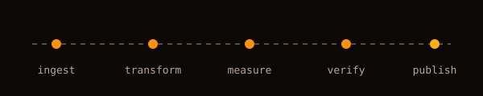
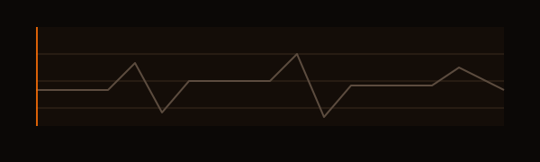

# Live demo

Every instrument in the catalog, embedded exactly the way a profile README would embed them. If you can see motion here, the pattern survives GitHub's sanitizer. (The repo hero shows the original five-cell composition; the catalog below is the complete set.)

## draw-on-line

## type-on-terminal

## dash-flow

## scanline-sweep

## breathe-glow

## staggered-reveal

## theme-aware

Flip your color scheme: this one file re-palettes itself — no `<picture>` wrapper.

## status-flip

---

Static fallback check: view any `pattern.svg` in a CSS-less renderer (or with reduced motion enabled) — each shows its finished state, never an empty frame.
